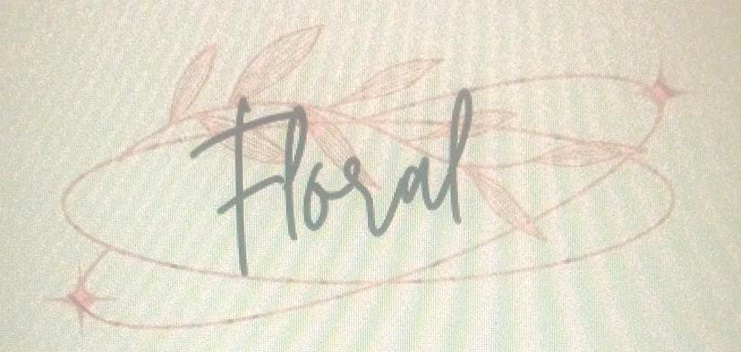

<h1 align="center"> Floral - Ecommerce Website </h1>

Hacktoberfest, in its 8th year, is a month-long celebration of open source software run by DigitalOcean. During the month of October, we invite you to join open-source software enthusiasts, beginners, and the developer community by contributing to open-source projects. You can do this in a variety of ways:

* Prepare and share your project for collaboration
* Contribute to the betterment of a project via pull requests
* Organize an event
* Mentor others
* Donate directly to open source projects

 

# Project Title

> <Subtitle>
> Include project description here.

---
 
  

## Features
- Insert list of features here

<!-- ## Screenshots
<table>
  <tr>
      <td>
    
      </td>
      <td>  
    
      </td>
  </tr>
  <tr>
    <td>  
    
      </td>
    <td>  
    
      </td>
  </tr>
</table>
-->

## Contributors
- <a href="https://github.com/dummy-co-der"> Anuj Maheshwari </a>
- <a href="https://github.com/kartik-raj7"> Kartikey Gupta </a>
- <a href="https://github.com/Mona-1818"> Mona Verma </a>

<!-- ## License

	With :heart: by <a href="https://www.google.com" target="_blank">Floral</a>

-->

